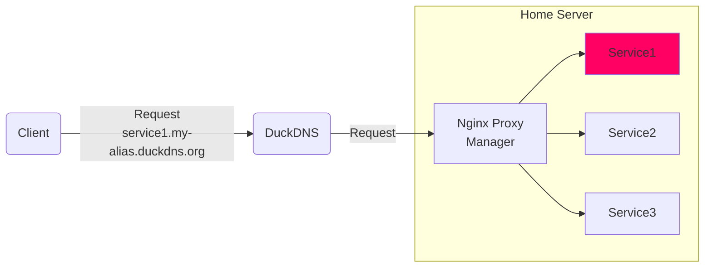

# Home media server

* [Overview](#overview)
* [Prerequisites](#prerequisites)
  + [Install Docker engine](#install-docker-engine)
  + [Install SSH server](#install-ssh-server)
  + [Enable remote desktop](#enable-remote-desktop)
* [Set up directories](#set-up-directories)
* [Set up services](#set-up-services)
  + [VPN configuration](#vpn-configuration)
  + [Start the services](#start-the-services)
  + [Access web UI for services](#access-web-ui-for-services)
  + [Manual service configuration](#manual-service-configuration)
* [Monitoring](#monitoring)
* [Remote Access](#remote-access)
* [Helpful commands](#helpful-commands)
* [Troubleshooting](#troubleshooting)
* [Additional notes](#additional-notes)

## Overview<!--{{{-->

This setup provides the ability to download media using BitTorrent (via
qBittorrent with VPN support) and/or Usenet (via SABnzbd). All media
is automatically categorized and served on the network via Plex Media Server.

All services in this guide are run in Docker containers managed via Docker
Compose.

| Service | Description |
| ------- | ----------- |
|   Plex | Organizes media and streams to smart devices |
|   qBittorrent | Torrent download client |
|   Wireguard | VPN Tunnel |
|  SABnzbd | Usenet download client |
|  Radarr | Movie collection manager, integrates with qBittorrent/SABnzbd |
|  Sonarr | TV show collection manager, integrates with qBittorrent/SABnzbd |
|  Prowlarr | Manages Torrent and Usenet indexers, integrates with Radarr/Sonarr |
|  Bazarr | Manages and downloads subtitles, integrates with Radarr/Sonarr |
|  Overseerr | Request management and media discovery tool for the Plex ecosystem |
|  Tautulli | Monitor Plex media server and track various statistics |

The remainder of this guide assumes the host server is running a Debian-based
operating system. My current setup is a Dell Optiplex 5060 Micro with an Intel
Core i5-8500T and 16GB of RAM running Ubuntu Server 22.04.<!--}}}-->

## Prerequisites

* [Install Docker engine](#install-docker-engine)
* [Install SSH server](#install-ssh-server)
* [Enable remote desktop](#enable-remote-desktop)

### Install Docker engine<!--{{{-->

Install using the convenience script:

```bash
curl -fsSL https://get.docker.com -o get-docker.sh
sudo sh ./get-docker.sh [--dry-run]
```

Run the [Linux post-installation](https://docs.docker.com/engine/install/linux-postinstall/)
steps to add your user to the `docker` group:

```bash
sudo groupadd docker
sudo usermod -aG docker $USER
newgrp docker
```
<!--}}}-->

### Install SSH server<!--{{{-->

**Note**: Not required for Ubuntu Server when openssh-server was installed at
setup time

To allow remote terminal access via SSH, install and configure `openssh` on the
host.

```bash
# install
sudo apt install  openssh-server
# enable service
sudo systemctl enable ssh --now
# start service
sudo systemctl start ssh
```

Test the SSH connection by logging in from another computer

```bash
ssh <host-username>@<host-ip>
```
<!--}}}-->

### Enable remote desktop<!--{{{-->

**Optional**

**Note**: Not required for Ubuntu Server since no desktop environment is
installed

To allow remote desktop access to the server from another computer, install and
configure `xrdp` on the host.

```bash
sudo apt update && sudo apt install xrdp
sudo systemctl enable xrdp
sudo ufw allow 3389/tcp
```

Install the Microsoft Remote Desktop application on any client computers you
with to connect from.

- Mac: [Microsoft Remote Desktop](https://apps.apple.com/us/app/microsoft-remote-desktop/id1295203466?mt=12)
- Windows: [Microsoft Remote Desktop](https://apps.microsoft.com/store/detail/9WZDNCRFJ3PS?hl=en-us&gl=US&rtc=1)
<!--}}}-->

## Set up directories<!--{{{-->

**Note**: The instructions below are designed for local storage on the host
filesystem. To store media on a network share or USB drive, see the [Additional
notes](#additional-notes) section. It is still recommended to store the
`/data/config` directory on the host filesystem.

Run the `setup.sh` script on the host to create the pre-determined directory
structure with the correct permissions. These folders will be used as volume
mounts for the Docker containers, and be referenced in each service's settings.

```bash
git clone git@github.com:nbn22385/htpc-docker.git
cd htpc-docker
./setup.sh
```

<details>
<summary>Expand to see the resulting folder structure</summary>

### The resulting directory structure for service configuration files:

```
/config
├── bazarr
├── plex
├── prowlarr
├── qbittorrent
├── radarr
├── sabnzbd
└── sonarr
```

### The resulting directory structure for data/media files:

```
/data
├── media
│   ├── movies
│   └── tv
├── torrents
│   ├── movies
│   └── tv
└── usenet
    ├── movies
    └── tv
```

</details> <!--}}}-->

## Set up services

Services are managed via Docker using `docker-compose`.

**Note:** The base paths for service configuration and data are set within the
`.env` file. Review the `.env` file and set `CONFIG_ROOT` and `DATA_ROOT` to
your preferred paths.

### VPN configuration<!--{{{-->

**Optional (enabled by default)**

**Note:** To disable use of a VPN for qBittorrent connections, remove the
`network_mode` line from the `qbittorrent` service in `docker-compose.yml`.
Configuration updates will need to be made to Prowlarr, Radarr, and Sonarr
download client settings, by pointing the server to `qbittorrent`, rather than
`wireguard`.

In order to use the Wireguard docker image, a Wireguard configuration file must
exist on the host as `/config/wireguard/wg0.cfg`. In many cases, the
configuration file can be generated by following the instructions specific to
your provider.

- If using the Private Internet Access (PIA) VPN, a config file is not provided
  and must be generated. I used the instructions in
  [this repository](https://github.com/hsand/pia-wg#linux-debianubuntu)
  to generate a configuration file. Once generated, ensure the output file is
  named `wg0.conf`, then copy it to the directory noted above.
- Update the `[Interface]` section of your config file to
  allow incoming traffic from the host (update the `HOMENET` IP as needed for
your network) ([Source](https://www.linuxserver.io/blog/routing-docker-host-and-container-traffic-through-wireguard#routing-docker-container-traffic-through-wireguard)):
  ```conf
  [Interface]
  # DNS: <I had to remove this line to reach the web interface>
  PostUp = DROUTE=$(ip route | grep default | awk '{print $3}'); HOMENET=192.168.29.0/24; HOMENET2=10.0.0.0/8; HOMENET3=172.16.0.0/12; ip route add $HOMENET3 via $DROUTE;ip route add $HOMENET2 via $DROUTE; ip route add $HOMENET via $DROUTE;iptables -I OUTPUT -d $HOMENET -j ACCEPT;iptables -A OUTPUT -d $HOMENET2 -j ACCEPT; iptables -A OUTPUT -d $HOMENET3 -j ACCEPT;  iptables -A OUTPUT ! -o %i -m mark ! --mark $(wg show %i fwmark) -m addrtype ! --dst-type LOCAL -j REJECT
  PreDown = HOMENET=192.168.29.0/24; HOMENET2=10.0.0.0/8; HOMENET3=172.16.0.0/12; ip route delete $HOMENET; ip route delete $HOMENET2; ip route delete $HOMENET3; iptables -D OUTPUT ! -o %i -m mark ! --mark $(wg show %i fwmark) -m addrtype ! --dst-type LOCAL -j REJECT; iptables -D OUTPUT -d $HOMENET -j ACCEPT; iptables -D OUTPUT -d $HOMENET2 -j ACCEPT; iptables -D OUTPUT -d $HOMENET3 -j ACCEPT
  ```
  <!--}}}-->

### Start the services<!--{{{-->

```bash
cd /path/to/htpc-docker
docker compose up -d
```
<!--}}}-->

### Access web UI for services<!--{{{-->

Once all services are running, you can access each service's web UI using the
URLs below:

| Service     | Role             | URL                               |
| ----------- | ---------------- | --------------------------------- |
| Plex        | Media server     | http://`<server-ip>`:32400/web    |
| qBitTorrent | Torrent client   | http://`<server-ip>`:8080         |
| SABnzbd     | Usenet client    | http://`<server-ip>`:8081/sabnzbd |
| Radarr      | Movie manager    | http://`<server-ip>`:7878         |
| Sonarr      | TV show manager  | http://`<server-ip>`:8989         |
| Prowlarr    | Indexer manager  | http://`<server-ip>`:9696         |
| Bazarr      | Subtitle manager | http://`<server-ip>`:6767         |
<!--}}}-->

### Manual service configuration

Settings must be manually configured for each service to properly use the
directory structure we set up, as well as adjust other behaviors and
integrations. I have listed the most important settings below, but adjust
anything else as needed.

* [Plex](#plex)
* [qBittorrent](#qbittorrent)
* [SABnzbd](#sabnzbd)
* [Radarr](#radarr)
* [Sonarr](#sonarr)
* [Prowlarr](#prowlarr)
* [Bazarr](#bazarr)
* [Overseerr](#overseerr)
* [Tautulli](#tautulli)

#### Plex<!--{{{-->

These custom settings are adapted from [TRaSH Guide for
Plex](https://trash-guides.info/Plex/Tips/Plex-media-server/).

<details>
<summary>Custom settings</summary>

- `Settings`
  - `General`
    - :white_square_button: Send crash reports to Plex
    - :white_square_button: Enable Plex Media Server debug logging
  - `Remote Access` (Optional)
    - :ballot_box_with_check: Remote access (Note: may need to forward router port 32400 to the host)
    - :ballot_box_with_check: Manually specify public port: 32400
  - `Library`
    - :ballot_box_with_check: Scan my library automatically
    - :ballot_box_with_check: Run a partial scan when changes are detected
    - :ballot_box_with_check: Run scanner tasks at a lower priority
- `Manage`
  - `Libraries`
    - `Movies`
      - `Manage Recommendations`
        - Disable any recommendations you don't want to the client screen
      - `Edit Library > Add Folders`
        - Ensure `/media/movies` is listed
    - `TV`
      - `Manage Recommendations`
        - Disable any recommendations you don't want to the client screen
      - `Edit Library > Add Folders`
        - Ensure `/media/tv` is listed
</details>
<!-- }}} -->

#### qBittorrent<!--{{{-->

These custom settings are adapted from [TRaSH Guide for
qBittorrent](https://trash-guides.info/Downloaders/qBittorrent/Basic-Setup/).

<details>
<summary>Custom settings</summary>

- `Settings`
  - `Downloads`
    - :ballot_box_with_check: Delete .torrent files afterwards
    - :ballot_box_with_check: Pre-allocate disk space for all files
    - Default torrent management mode: **Automatic**
    - Default save path: `/data/torrents`
    - :ballot_box_with_check: (Optional) Email notification upon download completion
      - From: "qBittorrent" (or any text)
      - To: Destination email address (I used the T-Mobile email-to-sms gateway
        <10-digit-number@tmomail.net>). Check your carrier.
      - SMTP server: smtp.gmail.com
      - :ballot_box_with_check: This server requires a secure connection (SSL)
      - `Authentication`
        - Username: <YOUR-EMAIL@gmail.com>
        - Password: [generate a Google app password](https://myaccount.google.com/apppasswords)
  - `Connection`
    - Peer connection protocol: **TCP**
  - `Speed`
    - `Global Rate Limits`
      - Set limits here if desired
  - `WebUI`
    - :ballot_box_with_check: Bypass authentication for clients on localhost
    - :ballot_box_with_check: Bypass authentication for clients in whitelisted IP subnets
      - Example: 192.168.1.0/24
    - :ballot_box_with_check: (Optional) Use alternative WebUI
      - [VueTorrent](https://github.com/WDaan/VueTorrent#manual) already exists
        in the container. To use it, set this path to `/vuetorrent`.
  - `Tags & Categories`
    - Add category `movies` with save path `/data/torrents/movies`
    - Add category `tv` with save path `/data/torrents/tv`
  - `Advanced`
    - Network Interface: **wg0** (this is the Wireguard interface)

Click the :floppy_disk: icon to apply the changes. Then (optionally) apply the custom VueTorrent settings:

  - `Settings`
    - `VueTorrent`
      - Copy/paste the following code and click the `Import Settings` button
          ```json
{"sort_options":{"isCustomSortEnabled":true,"sort":"priority","reverse":false,"filter":null,"category":null,"tag":null,"tracker":null},"webuiSettings":{"lang":"en","darkTheme":true,"showFreeSpace":true,"showSpeedGraph":true,"showSessionStat":true,"showAlltimeStat":true,"showCurrentSpeed":true,"showTrackerFilter":false,"showSpeedInTitle":false,"deleteWithFiles":false,"title":"Global Speed","rightDrawer":false,"topPagination":false,"paginationSize":15,"dateFormat":"DD/MM/YYYY, HH:mm:ss","openSideBarOnStart":false,"showShutdownButton":false,"useBitSpeed":false,"useBinaryUnits":false,"refreshInterval":2000,"contentInterval":5000,"torrentPieceCountRenderThreshold":5000,"busyDesktopTorrentProperties":[{"name":"Status","active":true},{"name":"Size","active":true},{"name":"Progress","active":true},{"name":"DownloadSpeed","active":true},{"name":"Downloaded","active":true},{"name":"SavePath","active":false},{"name":"UploadSpeed","active":true},{"name":"Uploaded","active":true},{"name":"ETA","active":true},{"name":"Peers","active":true},{"name":"Seeds","active":true},{"name":"Ratio","active":true},{"name":"Tracker","active":false},{"name":"Category","active":true},{"name":"Tags","active":false},{"name":"AddedOn","active":false},{"name":"Availability","active":false},{"name":"LastActivity","active":false},{"name":"CompletedOn","active":false},{"name":"AmountLeft","active":false},{"name":"ContentPath","active":false},{"name":"DownloadedSession","active":false},{"name":"DownloadLimit","active":false},{"name":"DownloadPath","active":false},{"name":"Hash","active":false},{"name":"InfoHashV1","active":false},{"name":"InfoHashV2","active":false},{"name":"SeenComplete","active":false},{"name":"TimeActive","active":false},{"name":"TotalSize","active":false},{"name":"TrackersCount","active":false},{"name":"UploadedSession","active":false},{"name":"UploadLimit","active":false},{"name":"GlobalSpeed","active":false},{"name":"GlobalVolume","active":false}],"doneDesktopTorrentProperties":[{"name":"Status","active":true},{"name":"Size","active":true},{"name":"Progress","active":true},{"name":"DownloadSpeed","active":true},{"name":"Downloaded","active":false},{"name":"SavePath","active":false},{"name":"UploadSpeed","active":true},{"name":"Uploaded","active":true},{"name":"ETA","active":false},{"name":"Peers","active":true},{"name":"Seeds","active":true},{"name":"Ratio","active":true},{"name":"Tracker","active":false},{"name":"Category","active":true},{"name":"Tags","active":false},{"name":"AddedOn","active":false},{"name":"Availability","active":false},{"name":"LastActivity","active":false},{"name":"CompletedOn","active":false},{"name":"AmountLeft","active":false},{"name":"ContentPath","active":false},{"name":"DownloadedSession","active":false},{"name":"DownloadLimit","active":false},{"name":"DownloadPath","active":false},{"name":"Hash","active":false},{"name":"InfoHashV1","active":false},{"name":"InfoHashV2","active":false},{"name":"SeenComplete","active":false},{"name":"TimeActive","active":false},{"name":"TotalSize","active":false},{"name":"TrackersCount","active":false},{"name":"UploadedSession","active":false},{"name":"UploadLimit","active":false},{"name":"GlobalSpeed","active":false},{"name":"GlobalVolume","active":false}],"busyMobileCardProperties":[{"name":"Status","active":true},{"name":"Tracker","active":false},{"name":"Category","active":true},{"name":"Tags","active":false},{"name":"Size","active":true},{"name":"Progress","active":true},{"name":"ProgressBar","active":true},{"name":"Ratio","active":false},{"name":"Uploaded","active":false},{"name":"ETA","active":true},{"name":"Seeds","active":true},{"name":"Peers","active":true},{"name":"DownloadSpeed","active":true},{"name":"UploadSpeed","active":true}],"doneMobileCardProperties":[{"name":"Status","active":true},{"name":"Tracker","active":false},{"name":"Category","active":true},{"name":"Tags","active":false},{"name":"Size","active":true},{"name":"Progress","active":true},{"name":"ProgressBar","active":true},{"name":"Ratio","active":false},{"name":"Uploaded","active":false},{"name":"ETA","active":true},{"name":"Seeds","active":true},{"name":"Peers","active":true},{"name":"DownloadSpeed","active":true},{"name":"UploadSpeed","active":true}]},"authenticated":true}
          ```

</details>
<!-- }}} -->

#### SABnzbd<!--{{{-->

These custom settings are adapted from [TRaSH Guide for
SABnzbd](https://trash-guides.info/Downloaders/SABnzbd/Basic-Setup/).

<details>
  <summary>Custom settings</summary>

- `Config`
  - `Folders`
    - Temporary Download Folder: **/data/usenet/incomplete**
    - Completed Download Folder: **/data/usenet**
    - Click `Save Changes`
  - `Servers`
    - Click `+ Add Server`
      - Enter the Host, Username, and Password for your Usenet provider
      - Test and add the server
  - `Categories`
    - Note: these paths are relative to the **Completed Download Folder** set above
    - For the `movies` category, set the Folder/Path to `movies`, click `Save`
    - For the `tv` category, set the Folder/Path to `tv`, click `Save`
  - `Special`
    - `Values`
      - `host_whitelist()`: Add an entry for the hostname `sabnzbd`
        - Note: This is necessary to allow access from Radarr/Sonarr

</details>
<!-- }}} -->

#### Radarr<!--{{{-->

These custom settings are adapted from [TRaSH Guide for
Radarr](https://trash-guides.info/Radarr/).

<details>
  <summary>Custom settings</summary>
  
- `Settings`
  - `Media Management`
    - :ballot_box_with_check: Rename Movies
    - :ballot_box_with_check: Replace Illegal Characters
    - `Root Folders`
      - Add an entry for `/data/media/movies`
  - `Indexers`
    - The indexers will auto-populate once Prowlarr is set up
    - Click `Show Advanced`
    - `RSS Sync Interval`: 0 (prevents hitting indexer API limits)
  - `Download Clients`
    - Click `+` and select `qBittorrent`
      - Host: **wireguard**
      - Username/Password: Use qbittorrent credentials
    - Click `+` and select `SABnzbd`
      - Host: **sabnzbd**
      - Port: **8080** (even though the web interface is 8081)
      - Api Key: **SABnzbd API key from its `Config > General (Security)` page**
      - :white_square_button: Remove Completed (I like to preserve SABnzbd history)
  - `Import Lists` (Optional, allows initiating downloads via the Plex Discover
    interface)
    - Click `+` and select `Plex Watchlist`
    - :ballot_box_with_check: Enable
    - :ballot_box_with_check: Enable Automatic Add
    - Monitor: select `None` to manually manage files in Radarr, otherwise
      leave default value
    - :ballot_box_with_check: Search on Add: enable to have Radarr automatically
      search for movie, otherwise leave default value
    - Quality Profile: select desired profile
    - Authenticate with Plex.tv: click button to authenticate
      - **Note**: Clicking `Test` will produce a warning if your Plex watchlist
        contains no movies
    - Click `Save`

</details>
<!-- }}} -->

#### Sonarr<!--{{{-->

These custom settings are adapted from [TRaSH Guide for
Sonarr](https://trash-guides.info/Sonarr/).

<details>
  <summary>Custom settings</summary>
  
- `Settings`
  - `Media Management`
    - :ballot_box_with_check: Rename Episodes
    - :ballot_box_with_check: Replace Illegal Characters
    - `Root Folders`
      - Add an entry for `/data/media/tv`
  - `Indexers`
    - The indexers will auto-populate once Prowlarr is set up
    - Click `Show Advanced`
    - `RSS Sync Interval`: 0 (prevents hitting indexer API limits)
  - `Download Clients`
    - Click `+` and select `qBittorrent`
      - Host: **wireguard**
      - Username/Password: Use qbittorrent credentials
    - Click `+` and select `SABnzbd`
      - Host: **sabnzbd**
      - Port: **8080** (even though the web interface is 8081)
      - Api Key: **SABnzbd API key from its `Config > General (Security)` page**
  - `Import Lists` (Optional, allows initiating downloads via the Plex Discover
    interface)
    - Click `+` and select `Plex Watchlist`
    - :ballot_box_with_check: Enable Automatic Add
    - Monitor: select `None` to manually manage files in Sonarr, otherwise
      leave default value
    - Quality Profile: select desired profile
    - Authenticate with Plex.tv: click button to authenticate
      - **Note**: Clicking `Test` will produce a warning if your Plex watchlist
        contains no shows
    - Click `Save`

</details>
<!-- }}} -->

#### Prowlarr<!--{{{-->

These custom settings are adapted from [Servarr Guide for
Prowlarr](https://wiki.servarr.com/prowlarr/quick-start-guide).

<details>
<summary>Custom settings</summary>

- `Settings`
  - Click `Show Advanced` (enables changing API limits below)
  - `Apps`
    - `Applications`
      - Click `+` and select `Radarr`
        - Prowlarr server: **http://prowlarr:9696**
        - Radarr server: **http://radarr:7878**
        - ApiKey: **Radarr API key from its `Settings > General` page**
      - Click `+` and select `Sonarr`
        - Prowlarr server: **http://prowlarr:9696**
        - Sonarr server: **http://sonarr:8989**
        - ApiKey: **Sonarr API key from its `Settings > General` page**
    - `Sync Profiles`
      - Click `+` (this will be used later in the Indexers configuration)
        - Name: **No RSS**
        - :white_square_button: Enable RSS
        - :ballot_box_with_check: Enable Interactive Search
        - :ballot_box_with_check: Enable Automatic Search
  - `Download Clients` (Optional)
    - Note: If you intend to do searches directly within Prowlarr, you need to
      add Download Clients. Otherwise, you do not need to add them here. For
      searches from your Apps, the download clients configured there are used
      instead.
    - Click `+` and select `qBittorrent`
      - Host: **wireguard**
      - Username/Password: Use qbittorrent credentials
    - Click `+` and select `SABnzbd`
      - Host: **sabnzbd**
      - Port: **8080** (even though the web interface is 8081)
      - Api Key: **SABnzbd API key from its `Config > General (Security)` page**
      - Default Category: you can add a `prowlarr` category in SABnzbd or use
        an existing category
  - `General`
    - `Security`
      - Authentication Required: **Disabled for Local Addresses**
- `Indexers`
  - `Add Indexer`
    - Search for an indexer and click to configure it
    - :ballot_box_with_check: Enable
    - Torrent indexers: 1337x, LimeTorrents, TorrentDownload, YTS
    - Usenet indexers (require accounts): abNZB, altHUB, DrunkenSlug
      - Sync Profile: **No RSS** (prevents hitting indexer API limits)
      - API Key: Get the API key from your indexer's settings page
      - Query/Grab Limit: See [this page](https://www.reddit.com/r/usenet/wiki/indexers)
        for indexer query and grab limits

</details>
<!-- }}} -->

#### Bazarr<!--{{{-->

These custom settings are adapted from [TRaSH Guide for
qBittorrent](https://trash-guides.info/Bazarr/Setup-Guide/).

<details>
  <summary>Custom settings</summary>
  
- `Settings`
  - `Languages`
    - `Subtitles Language > Languages Filter`
      - Add `English` to the list
    - `Language Profiles`
      - Add a new profile and choose the `English (Normal or hearing impaired)` language
      - You can also add `English (Forced)`
    - `Default Settings`
      - :ballot_box_with_check: Series
        - Profile: **English profile name**
      - :ballot_box_with_check: Movies
        - Profile: **English profile name**
  - `Providers`
    - Add: **OpenSubtitles.com, Embedded Subtitles, subf2m.co**
    - **Note**: Create an account on OpenSubtitles.com and input your login
      information
  - `Sonarr`
    - Address: **sonarr**
    - API Key: **Sonarr API key from its `Settings > General` page**
  - `Radarr`
    - Address: **radarr**
    - API Key: **Radarr API key from its `Settings > General` page**
  - `Scheduler`
    - Sonarr/Radarr Sync: 24 Hours (all boxes)
    - Disk Indexing: Manually (all boxes)
    - Search and Upgrade Subtitles: 24 Hours (all boxes)

</details>
<!-- }}} -->

#### Tautulli<!--{{{-->

<details>
  <summary>Custom settings</summary>

- `Settings`
  - `Homepage > Watch Statistics`
    - I unchecked a bunch of these to clean up the homepage
  - `Plex Media Server`
    - Plex IP Address: Choose local Plex server (192.168.x.y)
    - :ballot_box_with_check: Use secure connection
  - `Notification Agents`
    - Configure desired notification agent. I used email to SMS.

</details>
<!-- }}} -->

#### Overseerr<!--{{{-->

<details>
  <summary>Custom settings</summary>

- `Settings`
  - `Users > User Settings`
    - :ballot_box_with_check: Enable New Plex Sign-In
    - Global Movie Request Limit: set if desired
    - Global Series Request Limit: set if desired
  - `Plex`
    - `Plex Settings`
      - Server: Choose local Plex server (if not done during initial setup)
      - Hostname/IP: Enter server IP (if not done during initial setup)
    - `Plex Libraries`
      - Enable Movies and TV Shows (if not done during initial setup)
    - `Tautulli Settings` (optional)
      - Hostname/IP: Enter server IP (if not done during initial setup)
      - API Key: **Tautulli API key from its `Settings > Web Interface` page**
  - `Services`
    - `Radarr`
      - :ballot_box_with_check: Default Server
      - Hostname/IP: **radarr**
      - API Key: **Radarr API key from its `Settings > General` page**
      - Set `Quality Profile` and `Root Folder` as desired
    - `Sonarr`
      - :ballot_box_with_check: Default Server
      - Hostname/IP: **sonarr**
      - API Key: **Sonarr API key from its `Settings > General` page**
      - Set `Quality Profile` and `Root Folder` as desired
  - `Notifications`
    - Configure desired notification agent. I used email to SMS.

</details>
<!-- }}} -->

## Monitoring

A monitoring stack is included using Prometheus/Grafana with data collected via
cAdvisor and node-exporter. By default the monitoring services are deployed by
including the `monitoring/docker-compose.yml` file.

| Service | Description |
| ------- | ----------- |
|   Prometheus | Monitoring system & time series database |
|   Grafana | Analytics and interactive visualization web application |
|   cAdvisor | Provides resource usage and performance characteristics of running containers |
|  Node exporter | Exposes a wide variety of hardware- and kernel-related metrics |

The Grafana dashboard is accessible at `http://<server-ip>:3000`.


## Remote access

| Service | Description |
| ------- | ----------- |
|   DuckDNS | Static IP management |
|   Nginx Proxy Manager | Forwards traffic to your services running at home, including free SSL |

### DuckDNS

The [DuckDNS](https://www.duckdns.org/) service automatically keeps your
DuckDNS account in sync with your server's public IP address.

#### Create a DuckDNS account

1. Create a free DuckDNS account
1. Create a unique subdomain that will be used as an alias to your server's
   public IP address
1. Copy the Token from the DuckDNS account homepage
1. Write the token to a file that will be handled by Docker Secrets:
   ```bash
   printf "YOUR-TOKEN" > duckdns_token.secret
   ```

### Nginx Proxy Manager

The [Ngnix Proxy Manager](https://nginxproxymanager) service allows you to
manage subdomains for external access to your services, as well as manage
access lists to the subdomains.

The Nginx Proxy Manager dashboard is accessible at `http://<server-ip>:81`

#### Create an access list

1. On the `Access Lists` screen, click `Add Access List`
  1. In the "Detail" tab, set a name and enable `Pass Auth to Host`
  1. In the "Authorization" tab, set at least one username/password that will
     be used to access Proxy Hosts
  1. In the "Access" tab, set `allow` to `all`
  1. Click `Save`
  1. You can create multiple access lists, for example, one for admin only, and
     one that allows other users

#### Create proxy host(s)

DuckDNS will route any wildcard "sub-sub-domain" (i.e.
`service1.my-alias.duckdns.org`) to your server, so Nginx Proxy Manager can then
handle routing sub-sub-domain requests to your individual services within your
network. If this seems confusing, this diagram may help:



1. On the `Proxy Hosts` screen, click `Add Proxy Host`
  1. In the `Domain Names` box, create a subdomain for your service using the
     DuckDNS alias for your server. Example: `radarr.my-alias.duckdns.org`.
  1. Set the IP of your server and exposed port of your service
  1. Enable `Block Common Exploits`
  1. Set the Access List to the one created above, or else your service will
     publicly available (relies only on the service login, if any, for
     security)
  1. In the "SSL" tab, select "Request a new SSL Certificate".
  1. Enable "Force SSL" and create a new certificate


### Router port fowarding

In order to reach the server from the internet, configure your router to
forward ports 80 (HTTP) and 443 (HTTPS) to the Nginx Proxy Manager service. See
the [Nginx Proxy Manager
documentation](https://nginxproxymanager.com/guide/#hosting-your-home-network)
for more details.


## Helpful commands

### Starting and stopping services:<!--{{{-->

```bash
# Start services in the background (all by default, can specify individual service(s))
docker compose up [service-names] -d

# Stop services (all by default, can specify individual service(s))
docker compose down [service-names]
```
<!--}}}-->

### View logs for services:<!--{{{-->

```bash
docker compose logs <service-name>
```
<!--}}}-->

### Restart services and recreate volumes with recent updates:<!--{{{-->

```bash
docker-compose up --renew-anon-volumes|-V
```
<!--}}}-->

### Update Docker images to their latest versions<!--{{{-->

```
docker compose down
docker compose pull
docker compose up -d
docker image prune
```
<!--}}}-->

## Troubleshooting

### qBittorrent: Can't access web UI from the netowrk<!--{{{-->

I was able to restore access by running this command after starting services:

```bash
sudo iptables -t mangle -F
```
<!--}}}-->

## Additional notes

* [Mounting an external USB disk on host and Docker containers](#mounting-an-external-usb-disk-on-host-and-docker-containers)
* [Enable USB hard drive idle mode](#enable-USB-hard-drive-idle-mode)
* [Mounting a network share on host and Docker containers](#mounting-a-network-share-on-host-and-docker-containers)
* [Disable laptop suspend when lid is closed](#disable-laptop-suspend-when-lid-is-closed)
* [Restart host on a schedule](#restart-host-on-a-schedule)
* [Disable Wi-Fi radio](#disable-wi-fi-radio)
* [Useful packages](#useful-packages)

### Mounting an external USB disk on host and Docker containers<!--{{{-->

In this example, I have an NTFS-formatted external USB hard drive connected to
my host PC.

1. On the host PC, create a directory for the mount point.

```bash
sudo mkdir /mnt/usb
```

2. Get the UUID of the USB drive. Look for an entry that matches your drive.

```bash
sudo blkid

# example output
# ...
# /dev/sdb1: LABEL="MY_DRIVE" BLOCK_SIZE="512" UUID="ABCD1234" TYPE="ntfs" PARTUUID="00075ff3-01"
# ...
```

3. Edit the fstab file to automount the USB drive on boot. Use the UUID, mount
   point, and filesystem type found in the previous steps.

```bash
sudo vim /etc/fstab
```

```bash
UUID=ABCD1234 /mnt/usb ntfs defaults,noatime,nofail,umask=000 0 2
```

4. Mount the drive and ensure it is available at the mount point.

```bash
sudo mount -a

ls /mnt/usb
```

5. Set up download paths on the drive to be used by the services.

```bash
# create destination directories on the drive
DATA_DIR=/mnt/usb
sudo mkdir -pv ${DATA_DIR}/{torrents,usenet,media}/{tv,movies}
sudo chmod -Rv 775 ${DATA_DIR}/
sudo chown -Rv ${USER}:${USER} ${DATA_DIR}/
```

***If you are switching an internal drive to external storage for all media,
you can stop here. If you want to mount the external drive as additional mount
in the container (i.e. `/usb`, continue with the steps below to update service
settings.***

#### qBittorrent

- `Settings > Downloads > Default Save Path`: `/usb/torrents`
- `Categories > movies > Save Path`: `/usb/torrents/movies`
- `Categories > tv > Save Path`: `/usb/torrents/tv`

**Note**: if using VueTorrent UI, you might have to switch back to the default
UI to update the category paths

#### SABnzbd

- `Config > Folders > Temporary Download Folder`: `/usb/usenet/incomplete`
- `Config > Folders > Completed Download Folder`: `/usb/usenet`
- Click `Save Changes`

#### Plex

- `Settings > Manage > Libraries > Movies > Edit Library > Add Folders`: `/usb/media/movies`
- `Settings > Manage > Libraries > TV Shows > Edit Library > Add Folders`: `/usb/media/tv`

**Note**: you can remove any existing paths that are no longer needed

- `Home > Movies ... > Scan Library Files` to confirm changes took effect
- `Home > TV Shows ... > Scan Library Files` to confirm changes took effect

#### Radarr

- `Settings > Media Management > Root Folders`: Add `/usb/media/movies`
- `Settings > Lists > PlexImport > Root Folder`: `/usb/media/movies`
- `Movies > Edit Movies > Select All > Edit`: Change Root Folder to
  `/usb/media/movies`, Apply, Allow moving files

**Note**: you can remove any existing paths that are no longer needed

#### Sonarr

- `Settings > Media Management > Root Folders`: Add `/usb/media/tv`
- `Settings > Import Lists > PlexImport > Root Folder`: `/usb/media/tv`
- `Series > Mass Editor > Select All`: Change Root Folder to
  `/usb/media/tv`, Allow moving files

**Note**: you can remove any existing paths that are no longer needed<!--}}}-->

### Enable USB hard drive idle mode<!--{{{-->

Some USB hard drives do not spin down after a period of time. This section
describes how to enable the functionality manually.

1. Download and install the [`hd-idle`](https://github.com/adelolmo/hd-idle)
   utility.

```bash
curl -L https://github.com/adelolmo/hd-idle/releases/download/v1.20/hd-idle_1.20_amd64.deb -o hd-idle.deb
sudo dpkg -i hd-idle.deb
```

2. Configure `hd-idle` to set the idle timeout for your USB drive (in seconds).
   The UUID is found via `sudo blkid`.

```bash
sudo vim /etc/default/hd-idle
```

```
# Uncomment and update this line to enable the utility
START_HD_IDLE=true

# Uncomment and update this line to configure the idle timeout value
HD_IDLE_OPTS="-i 0 -a /dev/disk/by-uuid/<DRIVE-UUID> -i 600"
```

3. Start the `hd-idle` service.

```bash
systemctl unmask hd-idle.service
systemctl start hd-idle
systemctl enable hd-idle
```
<!--}}}-->

### Mounting a network share on host and Docker containers<!--{{{-->

**Note**: This will result in non-optimal copying/moving due to hardlinks not
functioning across filesystems/shares. For this reason, I am using a USB hard
drive directly connected to the host PC rather than this method, but leaving
these steps here for reference.

This example assumes a USB hard drive is connected to the router's USB port,
and is shared as an SMB share on the network.

1. On the host, install `cifs` and create the directory to be used
   as the mount point

```bash
sudo apt install cifs-utils -y
sudo mkdir /mnt/smb-share # directory that will act as the mount point for the SMB share
```

3. Edit the fstab file to automount the network share on boot (and after network is up)

```bash
sudo vim /etc/fstab
```

```bash
# <SHARE-IP>/<DIRECTORY>  <MOUNT-POINT>   <TYPE> <OPTIONS>                <BACKUP> <FSCK>
//192.168.29.1/usb-drive  /mnt/smb-share  cifs   _netdevuid=nate,vers=1.0 0        0
```

2. In Plex, add the shared directory(s) to your library. In this example, I
   mapped the shared directory to `/smb-share` in the container.

```yml
plex:
  volumes:
    - /mnt/smb-share:/smb-share
```
<!--}}}-->

### Disable laptop suspend when lid is closed<!--{{{-->

When using a laptop as a server, the system may suspend when the lid is closed.
To prevent this, make the following modification and restart the computer.

```bash
sudo vim /etc/systemd/logind.conf
```

Uncomment and edit the following lines:

```text
HandleLidSwitch=ignore
HandleLidSwitchExternalPower=ignore
```
<!--}}}-->

### Restart host on a schedule<!--{{{-->

I set the host PC to restart every Sunday at 4 AM with a Cron job

```bash
sudo crontab -e

# add the following line, save, and quit the editor
0 4 * * SUN /sbin/reboot

# verify the rule was saved
sudo crontab -l
```
<!--}}}-->

### Disable Wi-Fi radio<!--{{{-->

Find the wlan adapter name, then disable
the radio:

```bash
sudo lshw -C network

# example output:
# logical name: <wireless adapter name>

sudo apt install net-tools
sudo ifconfig <wireless adapter name> down
```
<!--}}}-->

### Useful packages<!--{{{-->

```bash
LAZYGIT_VERSION=$(curl -s "https://api.github.com/repos/jesseduffield/lazygit/releases/latest" | grep -Po '"tag_name": "v\K[^"]*')
curl -Lo lazygit.tar.gz "https://github.com/jesseduffield/lazygit/releases/latest/download/lazygit_${LAZYGIT_VERSION}_Linux_x86_64.tar.gz"
tar xf lazygit.tar.gz lazygit
sudo install lazygit /usr/local/bin

sudo apt install -y
  unzip
  ripgrip
  fd-find
  net-tools
  tree

curl -L https://bit.ly/glances | /bin/bash
```
<!--}}}-->

<!--
vim:fdm=marker
-->
